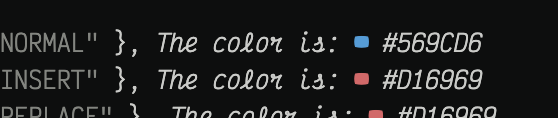
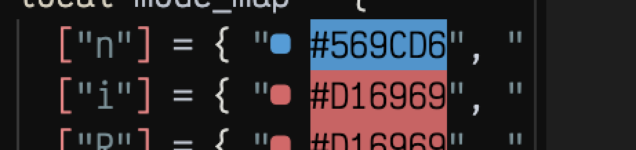

# colorblocks.nvim

> A minimal Neovim plugin to display color preview blocks next to hex codes like `#FF0000`.


## ✨ Features

-  Highlights hex codes with colored virtual `■` blocks
-  Matches `#RRGGBB` hex color patterns
-  Custom layout (section = { "S", "  ", "H" } etc)
-  Configurable foreground (`fg`) or background (`bg`) mode
-  Commands to toggle, enable, disable
-  Minimal, fast, and dependency-free

##  Installation (with lazy.nvim)

```lua
{
  "Bishop-Fox/colorblocks.nvim",
  config = function()
    require("colorblocks").setup({
      symbol = "v󱡕",
      virt_text_pos = "eol",
      mode = "fg",
      section = { "S", "  ", "The color is: ", "H" },
      filetypes = { "lua", "css" },
    })
  end,
}
```

## 🧪 Usage

```lua
local red = "#FF0000"  -- ● The color is: #FF0000
```

```lua
local mode_map = {
  ["n"] = { "#569CD6", "NORMAL" },
  ["i"] = { "#D16969", "INSERT" },
  ["c"] = { "#608B4E", "COMMAND" },
}
```

## 🔧 Commands

- `:ColorBlocksToggle` — toggle visibility on/off
- `:ColorBlocksEnable` — turn on highlights
- `:ColorBlocksDisable` — clear extmarks

## 🔍 Screenshot Previews




## 🧰 File Layout

```
colorblocks.nvim/
├── lua/colorblocks/init.lua      → plugin entrypoint
├── lua/colorblocks/core.lua      → highlight logic
├── dev/init.lua                  → test loader
├── examples/sample.lua           → example file with colors
├── tests/                        → placeholder for future tests
├── docs/                         → optional Vim help
├── stylua.toml                   → formatting config
├── .gitignore                    → git hygiene
└── .github/workflows/test.yml    → CI stub
```

## 📄 License

MIT
